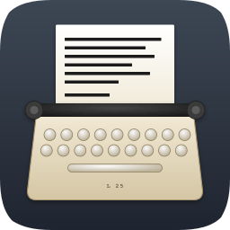
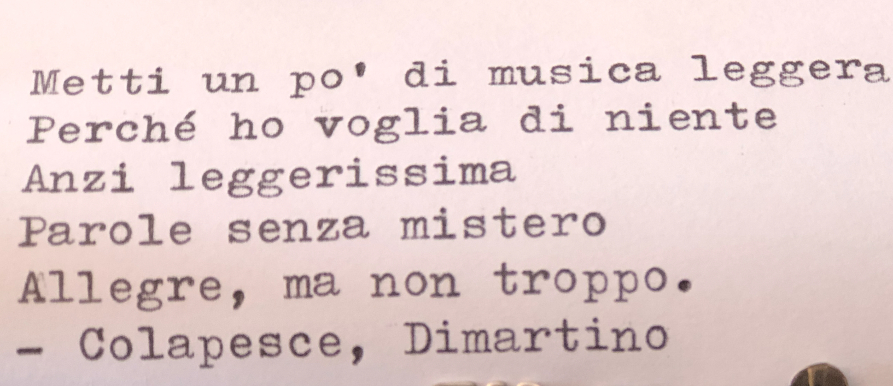
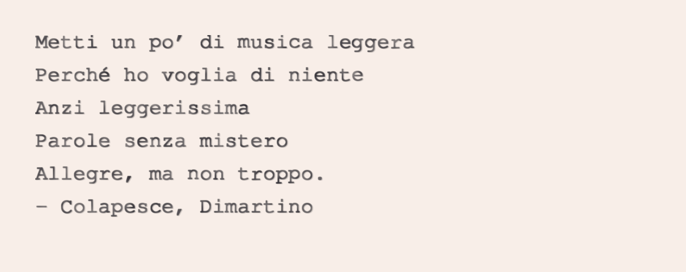
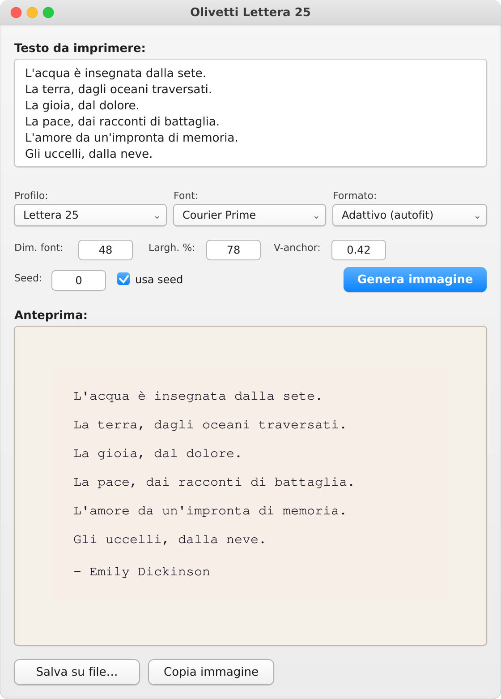

<div align="center">



# Olivetti Lettera 25 — macOS

**Generatore nativo di immagini tipografiche con l'estetica di una vera Olivetti Lettera 25**


Applicazione GUI nativa scritta in Python e Cocoa/AppKit via PyObjC,
impacchettata come bundle `.app` standalone con py2app.

[Cosa fa](#cosa-fa) · [Compilazione passo passo](#compilazione-passo-passo) · [Architettura](#architettura) · [Il modello](#il-modello-matematico) · [Troubleshooting](#troubleshooting)

</div>

---

## Cosa fa

**Lettera 25** trasforma qualsiasi testo in un'immagine PNG che simula
fedelmente l'impressione meccanica di una macchina da scrivere Olivetti
Lettera 25 (prodotta dalla Olivetti tra il 1974 e il 1989). Non si limita
a usare un font monospazio: modella una decina di fenomeni fisici distinti
dell'impressione meccanica, parte fissi nei profili e parte regolabili in
tempo reale — incluso il **nastro bicolore nero/rosso** e lo **sporco del
nastro**, per un'aderenza spinta all'esperienza analogica.

### Confronto con una battitura reale

<div align="center">

| Foto della macchina reale | Output dell'applicazione |
|:---:|:---:|
|  |  |

</div>

### Interfaccia

<div align="center">

</div>

### Profili supportati

| Profilo | Estetica | Uso tipico |
|---------|----------|------------|
| **Lettera 25** | Macchina in buone condizioni, impressione carica con leggere irregolarità | Riprodurre fedelmente una battitura reale |
| **Poesia** | Stampa digitale pulita, layout poetico su foglio | Citazioni e poesie da pubblicare online |
| **Vintage** | Macchina usurata, nastro consumato | Estetica "anni '70, dattiloscritto d'archivio" |

### Controlli interattivi

Oltre al profilo, l'interfaccia espone alcune scelte di resa:

| Controllo | Funzione |
|-----------|----------|
| **Font** | Famiglia tipografica. Due font typewriter sono **inclusi nel bundle** — Courier Prime e Special Elite — affiancati ai font monospazio di sistema (Courier, American Typewriter, Menlo, Monaco). Qualunque `.ttf/.otf` aggiunto in `assets/fonts/` compare in automatico. |
| **Sfondo** | Colore del foglio: `Profilo` (il colore calibrato del profilo), `Bianco` o `Avorio`. Sovrascrive solo la carta, non l'inchiostro. |
| **Imperfezioni** | Intensità (0–100) di nastro secco/sporco: erosione casuale dei glifi, jitter extra, flecks e peli di nastro sul foglio. |
| **Nastro rosso** | Probabilità (0–100) che un glifo "pizzichi" la banda rossa del nastro bicolore: lettera tutta rossa, rossa-sopra/nera-sotto, oppure sbavatura rossa. |

I controlli numerici restanti (dimensione font, larghezza colonna, ancoraggio
verticale, seed) governano composizione e ripetibilità.

---

## Compilazione passo passo

Procedura testata su macOS Sonoma (14) e Sequoia (15), con Python 3.13
da `python.org`. Tempi indicativi: **10–15 minuti** la prima volta (di cui
3–4 di download PyObjC), 1 minuto le volte successive.

### Passo 1 — Prerequisiti

Sul Mac servono tre cose:

**1.1 — macOS 11 o successivo.** Verifica con `sw_vers`:

```bash
sw_vers
```

**1.2 — Xcode Command Line Tools** (per compilare estensioni native di
PyObjC). Verifica:

```bash
xcode-select -p
```

Se l'output è vuoto o dà errore, installale:

```bash
xcode-select --install
```

Si apre un dialogo grafico, accetta, attendi (~600 MB).

**1.3 — Python da `python.org`** (NON il Python di sistema, NON quello di
Homebrew). py2app richiede un *framework build* per produrre bundle
standalone funzionanti.

Vai su [python.org/downloads/macos](https://www.python.org/downloads/macos/),
scarica l'ultima `3.12` o `3.13`, installa il `.pkg`. Al termine,
**doppio clic** su `Install Certificates.command` e `Update Shell Profile.command`
nella cartella che si apre.

**Chiudi e riapri il Terminale**, poi verifica:

```bash
which python3
```

Output atteso (la versione minor può variare):
```
/Library/Frameworks/Python.framework/Versions/3.13/bin/python3
```

⚠ Se vedi `/usr/bin/python3` o `/opt/homebrew/bin/python3`, il PATH non è
stato aggiornato. Riavvia il Terminale o aggiungi manualmente
`/Library/Frameworks/Python.framework/Versions/3.13/bin` al PATH.

### Passo 2 — Clone del repository

⚠ **Punto importante**: scegli un percorso **senza spazi** né caratteri
accentati. py2app ha bug noti con i path contenenti spazi.

```bash
mkdir -p ~/Sviluppo
cd ~/Sviluppo
git clone https://github.com/braucci/lettera25-macos.git
cd lettera25-macos
```

Verifica:
```bash
pwd
ls
```

Output atteso:
```
/Users/biagio/Sviluppo/lettera25-macos
LICENSE       app.py        core.py       requirements.txt
README.md     assets        build.sh      setup.py
```

### Passo 3 — Sanity check del solutore

Prima di compilare la GUI, verifichiamo che la logica di dominio funzioni
sul tuo Mac. È il principio della **validazione del solutore prima del
post-processing**.

```bash
python3 -m pip install --user Pillow
python3 core.py
```

Output atteso:

```
[1/5] OK  Determinismo con seed fisso.
[2/5] OK  Dimensioni foglio = (1200, 1500).
[3/5] OK  Profilo 'poesia' deterministico anche senza seed.
[4/5] OK  Sostituzioni tipografiche italiane (5 casi).
[5/5] OK  Profilo invalido -> ValueError.

Tutti i sanity check sono passati.
```

### Passo 4 — Font (già inclusi)

Dalla v1.2.0 i font typewriter **viaggiano dentro il bundle**
(`assets/fonts/`): Courier Prime (SIL OFL 1.1) e Special Elite
(Apache 2.0). Non devi installare nulla: compaiono nel menu **Font**
insieme ai monospazio di sistema. Per aggiungerne altri, copia un
`.ttf/.otf` in `assets/fonts/` e includilo in `DATA_FILES` dentro
`setup.py`: l'app lo scopre da sé.

Se vuoi anche averli a livello di sistema (per altre app), copiali in
`~/Library/Fonts/`:

```bash
cp assets/fonts/*.ttf ~/Library/Fonts/
```

### Passo 5 — Build del bundle `.app`

```bash
cd ~/Sviluppo/lettera25-macos
./build.sh
```

Cosa accade:

1. Pulizia delle build precedenti
2. Creazione di un virtualenv `.venv/`
3. Installazione di `pyobjc-core`, `pyobjc-framework-Cocoa`, `Pillow`, `py2app`
4. Compilazione dell'iconset in `assets/icon.icns` con `iconutil`
5. Esecuzione di `py2app` in modalità standalone

La prima volta richiede **5–7 minuti** (PyObjC è grande). Le volte
successive ~1 minuto.

Al termine vedrai:

```
==> Build completata: /Users/biagio/Sviluppo/lettera25-macos/dist/Lettera 25.app

Per aprire l'app:
   open "/Users/biagio/Sviluppo/lettera25-macos/dist/Lettera 25.app"
```

### Passo 6 — Primo avvio

```bash
open "dist/Lettera 25.app"
```

⚠ **Gatekeeper.** Trattandosi di un bundle non firmato con Apple Developer
ID, macOS lo blocca al primo lancio:

> "Lettera 25" non può essere aperta perché lo sviluppatore non può essere verificato.

Sblocco una tantum:

- **macOS 11–13**: clic destro sull'icona del bundle → **Apri** → confermi.
- **macOS 14+**: vai in **Impostazioni di Sistema** → **Privacy e sicurezza** → in fondo trovi *"Lettera 25 è stata bloccata…"* con il pulsante **Apri comunque**.

I lanci successivi non chiederanno più conferma.

### Passo 7 — Installazione definitiva

Per averla in Launchpad/Spotlight come una vera app:

```bash
cp -R "dist/Lettera 25.app" /Applications/
```

(Uso `-R` invece di `-r` su macOS per preservare xattr e symlink interni
ai framework Python.)

Da questo momento `Lettera 25` compare in Spotlight (`⌘+Spazio` → "Lettera").

---

## Architettura

Il progetto applica la separazione tra **logica di dominio** e
**presentazione**, ricalcando la distinzione classica tra **solutore** e
**post-processore** di una simulazione numerica.

```
lettera25-macos/
├── core.py            # Solutore: logica di rendering pura.
│                      # Solo Pillow + stdlib. Nessuna dipendenza
│                      # da AppKit/PyObjC. Testabile in isolamento.
├── app.py             # Post-processore: GUI Cocoa via PyObjC.
│                      # AppDelegate, NSWindow, controlli, target/action.
├── setup.py           # Configurazione py2app
├── build.sh           # Script di build automatizzato
├── requirements.txt
├── README.md
├── LICENSE
├── .gitignore
├── assets/
│   ├── icon.svg       # Master vettoriale 1024×1024 (squircle Big Sur+)
│   ├── icon.icns      # Icona compilata, riferita da setup.py
│   ├── icon.iconset/  # 10 PNG canoniche Apple (16…512@2x)
│   └── fonts/         # Font inclusi nel bundle (+ testi di licenza)
│       ├── CourierPrime-Regular.ttf       # SIL OFL 1.1
│       ├── SpecialElite-Regular.ttf       # Apache 2.0
│       └── LICENSE-*.txt
└── docs/
    ├── sample_real.jpg     # Foto di confronto (battitura reale)
    ├── sample_app.png      # Output dell'app
    ├── sample_poesia.png   # Esempio profilo "poesia"
    └── screenshot_ui.png   # Screenshot interfaccia
```

### Perché questa separazione

Il solutore `core.py` può essere collaudato indipendentemente dalla GUI
con il blocco `if __name__ == "__main__"` (cinque sanity check sulle
invarianti del dominio). Lo stesso `core.py` alimenta sia questa app
macOS sia una versione GTK su Linux, dimostrando che il disaccoppiamento
è reale.

L'analogia ingegneristica: un solutore di Navier-Stokes scritto in
Fortran resta lo stesso indipendentemente dal fatto che il
post-processing avvenga in Tecplot, ParaView o gnuplot.

### Convenzioni PyObjC

Il file `app.py` rispetta rigorosamente la separazione tra **selettori
Cocoa** e **helper Python**:

- I metodi che terminano con `_` (es. `generateClicked_`, `saveClicked_`)
  sono selettori Cocoa veri, mappati su `:` in Objective-C. **Non sono
  decorati**.
- Tutti gli altri metodi (helper interni, costruttori UI, formattatori)
  sono decorati con `@objc.python_method` per evitare il
  `BadPrototypeError` del bridge.
- Le funzioni pure (`find_best_font`, `pil_to_nsimage`,
  `pil_to_pasteboard`) sono fuori dalla classe, a livello modulo.

---

## Il modello matematico

Il motore di rendering modella sette fenomeni fisici distinti, ciascuno
operante a una scala spaziale diversa:

| Scala | Fenomeno fisico | Modello |
|-------|-----------------|---------|
| Inter-glifo (posizione)    | Gioco meccanico del carrello | `(dx, dy) ~ N(0, σ_x), N(0, σ_y)` |
| Inter-glifo (orientamento) | Usura del perno del martelletto | `θ ~ U(-θ_max, +θ_max)` |
| Inter-glifo (forza)        | Variabilità della pressione di battuta | `α_global ~ U(ink_min, ink_max)` |
| Intra-glifo (inchiostro)   | Disomogeneità del nastro inchiostratore | Maschera di value-noise a bassa freq. |
| Intra-glifo (geometria)    | Diffusione capillare nei contro-grafemi | Dilatazione morfologica `MaxFilter(3)` + blend |
| Intra-glifo (sub-pixel)    | Diffusione dell'inchiostro nelle fibre | Convoluzione gaussiana (eq. del calore) |
| Doppio impatto             | Rimbalzo elastico del martelletto | Stampa doppia con offset e α_ghost |
| Nastro bicolore            | Slug a cavallo della frontiera nero/rosso | Tint rosso, split rosso/nero a soglia sfumata, ghost rosso |
| Sporco del nastro          | Nastro secco, peli, residui d'inchiostro | Erosione da noise extra + flecks sparsi (densità ∝ area) |

I primi sette fenomeni sono fissati nei profili; gli ultimi due sono
regolabili dagli slider *Imperfezioni* e *Nastro rosso* (default 0, quindi
inattivi finché non li alzi: il comportamento dei profili resta invariato).

### Giustificazione delle scelte distributive

- **Gaussiana per la posizione**: il disallineamento dipende da molte
  cause indipendenti (vibrazioni, gioco, forza). Per il teorema del
  limite centrale, la loro somma tende a una normale.
- **Uniforme per la rotazione**: è dominata da un singolo parametro
  fisico (l'angolo di usura del perno).
- **Convoluzione gaussiana per il bleed**: la diffusione capillare
  dell'inchiostro sulle fibre è governata dall'equazione del calore,
  la cui funzione di Green è una gaussiana.

---

## Troubleshooting

### `xcrun: error: invalid active developer path`

Mancano le Command Line Tools di Xcode:

```bash
xcode-select --install
```

### `Multiple top-level modules discovered`

Setuptools troppo vecchio. Aggiorna nel virtualenv:

```bash
source .venv/bin/activate
pip install --upgrade setuptools
deactivate
./build.sh
```

### L'app si chiude subito al doppio clic

py2app può produrre bundle che falliscono silenziosamente. Per ottenere
il traceback Python, esegui dal Terminale **l'eseguibile interno al
bundle** (NON il bundle):

```bash
"dist/Lettera 25.app/Contents/MacOS/Lettera25"
```

Nota i due nomi diversi: il bundle è `Lettera 25.app` (con spazio,
da `CFBundleName`), l'eseguibile interno è `Lettera25`
(senza spazio, da `CFBundleExecutable`).

### `ERRORE: bundle non trovato in .../Lettera25.app`

Bug fixato nella v1.0.1: lo script cercava il bundle senza spazio mentre
py2app lo produce con spazio (`Lettera 25.app`). Aggiorna il repository
o modifica manualmente `APP_NAME="Lettera 25"` in `build.sh`.

### PyObjC fallisce a installarsi su Apple Silicon

Probabile mismatch architettura. Verifica:

```bash
uname -m
python3 -c "import platform; print(platform.machine())"
```

Devono coincidere (entrambi `arm64` o entrambi `x86_64`). Se differiscono,
hai installato un Python di architettura sbagliata: riscarica da
python.org la versione "universal2".

### Crash con `'NSWindow' object has no attribute 'setStyleMask_'`

Versione PyObjC troppo vecchia. Aggiorna nel virtualenv:

```bash
source .venv/bin/activate
pip install --upgrade pyobjc-core pyobjc-framework-Cocoa
deactivate
./build.sh
```

---

## Note sulla distribuzione

Il bundle prodotto da `build.sh` **non è firmato** né notarizzato. Per
distribuirlo "pulito" agli utenti finali (senza il dialogo Gatekeeper di
primo lancio) servirebbero:

1. Apple Developer ID ($99/anno)
2. Firma con `codesign --deep --sign "Developer ID Application: ..."`
3. Notarizzazione con `xcrun notarytool submit`
4. Stapling con `xcrun stapler staple`

Procedura documentata in
[Notarizing macOS Software](https://developer.apple.com/documentation/security/notarizing_macos_software_before_distribution).

Per uso personale o didattico, il bundle non firmato è perfettamente
funzionale: serve solo lo sblocco una tantum su Gatekeeper.

---

## Versioni correlate

Esiste una versione GTK/Arch Linux di questo stesso progetto, con lo
stesso `core.py` (la separazione dominio/presentazione si è dimostrata
robusta):
[braucci/lettera25](https://github.com/braucci/lettera25) (GTK4 + makepkg).

---

## Licenza

Distribuito sotto licenza **MIT**. Vedi [`LICENSE`](LICENSE).

I font inclusi in `assets/fonts/` mantengono le rispettive licenze, anch'esse
incluse nel repository e nel bundle:

- **Courier Prime** (Quote-Unquote Apps) — SIL Open Font License 1.1
- **Special Elite** (Astigmatic) — Apache License 2.0

I marchi *Olivetti* e *Lettera 25* sono di Olivetti S.p.A. Uso
puramente descrittivo, nessuna affiliazione.

---

## Crediti

Sviluppato da **Biagio Raucci** ([@braucci](https://github.com/braucci)),
ingegnere aerospaziale e professore di Costruzioni Aeronautiche, con
passione per la tipografia meccanica.

Calibrato su battiture reali di una Olivetti Lettera 25 in buone
condizioni meccaniche, anno di produzione metà anni '80.

<div align="center">

*"L'acqua è insegnata dalla sete."* — Emily Dickinson

</div>
